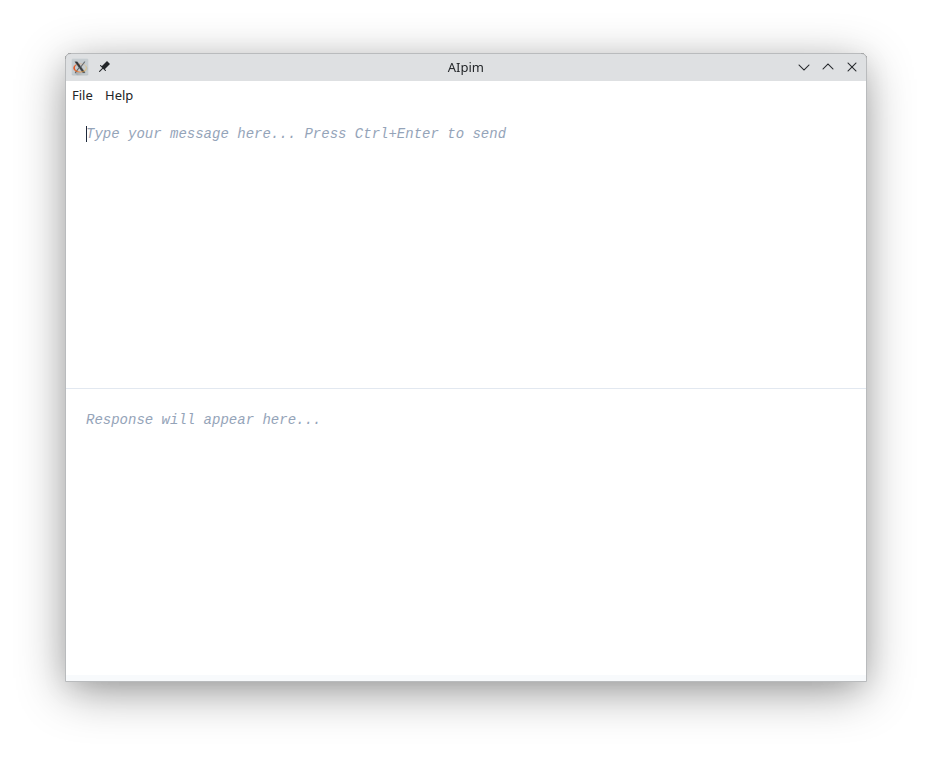
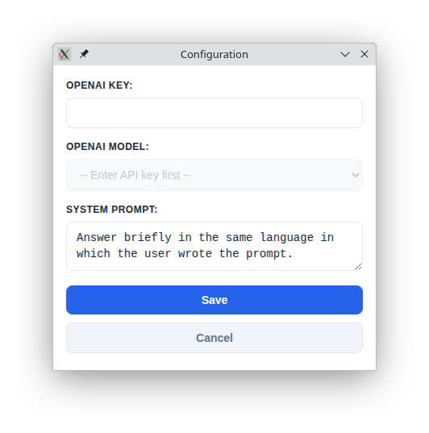

# AIpim

<div align="center">


**A simple, fast desktop application for OpenAI API interactions**

[](https://github.com/llagerlof/aipim)
[](LICENSE)
[](https://electronjs.org/)

</div>

## 📖 Overview

AIpim is perfect for quick AI-powered text generation without the overhead of a web browser.

This application is a lightweight electron-based desktop application that provides a streamlined interface for interacting with OpenAI's API.

### 🖼️ Main Window



## 💡 But why?

A common scenario is when we need to ask something ephemeral to ChatGPT. We need to open the browser, visit the website, select the temporary chat option, click the textarea, write or paste, press ENTER, select the answer, and copy it (sigh).

For these ephemeral prompts AIpim can help a lot. In `File > Configuration`, set your OpenAI key and the model. If you don't know which one you want to use, select `gpt-4.1-nano`, which is cheap and very good. Don't forget ot bind the script `start` to something you like (I use _CTRL+Shift+F11_).

Let's simulate the same action I described above, now using AIpim. If we need to ask ChatGPT something ephemeral, just call the AIpim app using the shortcut you configured, or run the `start` script directly from the terminal. Write or paste the text and press CTRL+ENTER. When the answer arrives it is already selected, so just press ENTER twice to copy the answer and automatically close the program.

This is not an app for conversation; it's an app for quick question-answer-copy.

## ✨ Features

- **Simple Interface**: Clean, distraction-free UI with two text areas
- **Fast Response**: Direct API integration for quick responses
- **Keyboard Shortcuts**: 
  - `Ctrl+Enter` to send messages
  - `Enter` twice on selected text to copy and close
  - `Esc` to close without copying
- **Configurable**: Customizable system prompts and model selection
- **Cross-Platform**: Works on Linux and Windows. Maybe macOS.
- **Clipboard Integration**: Quick and easy copy answer to clipboard

## 🚀 Installation

### Prerequisites
- Node.js (v14 or higher)
- npm or yarn

### Build from Source

1. **Clone the repository**
   ```bash
   git clone https://github.com/llagerlof/aipim.git
   cd aipim
   ```

2. **Install dependencies**
   ```bash
   npm install
   ```

3. **Run the application**
   ```bash
   npm start # or just run the script `start` if you are using Linux
   ```

## ⚙️ Configuration

1. Launch AIpim
2. Go to **File > Configuration**
3. Enter your OpenAI API key
4. Select your preferred model (automatically fetched from OpenAI - I suggest `gpt-4.1-nano`, which is good, fast and cheap)
5. Customize the system prompt
6. Click **Save**

### 🖼️ Configuration window



## 🎯 Usage

1. **Type your message** in the top text area.
2. **Press `Ctrl+Enter`** to send to OpenAI.
3. **Review the response** in the bottom text area.
4. **Select specific text** only if you want to copy part of the response. By default, all the response is already selected.
5. **Press `Enter` twice** to copy selected text to clipboard and automatically close the app.
6. Or **Press `Esc`** to close without copying anything

### Available Scripts

- `npm start` - Launch the application in development mode
- `start` - Shell script (bash) to run the command above. It's also good for binding a shortcut to it.

## 🤝 Contributing

Contributions are welcome! Please feel free to submit a Pull Request. For major changes, please open an issue first to discuss what you would like to change.

---

<div align="center">
**Made with ❤️ for the AI community**
</div>
